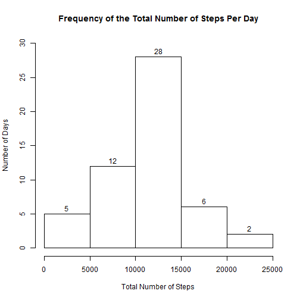
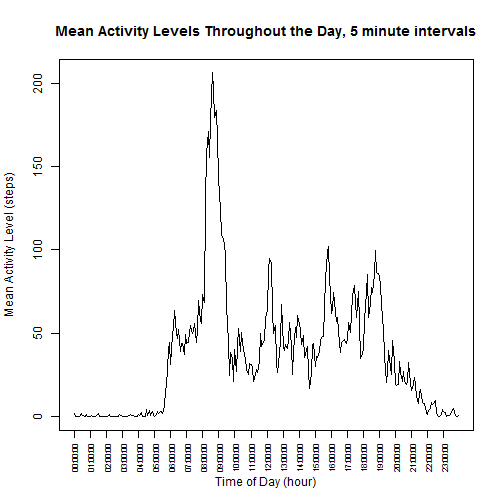
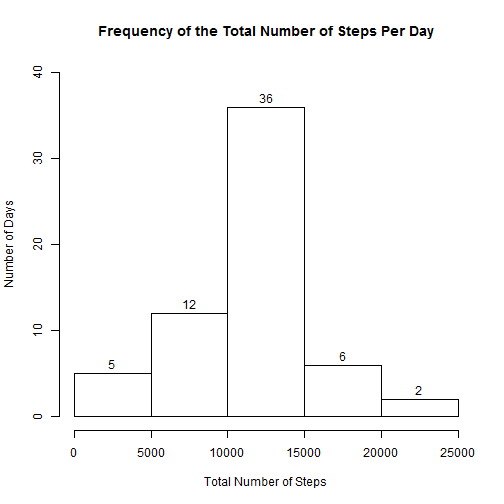

# Introduction

It is now possible to collect a large amount of data about personal movement using activity monitoring devices such as a Fitbit, Nike Fuelband, or Jawbone Up. 

In this assignment, I use data from a personal activity monitoring device for data analysis. As described in the course notes, the monitoring device "collects data at 5 minute intervals through out the day. The data consists of two months of data from an anonymous individual collected during the months of October and November, 2012 and include the number of steps taken in 5 minute intervals each day."


# Data

The variables included in this data-set are:

#. **steps:** Number of steps taking in a 5-minute interval (missing values are coded as NA)

#. **date:** The date on which the measurement was taken in YYYY-MM-DD format

#. **interval:** Identifier for the 5-minute interval in which measurement was taken

The data-set is stored in a comma-separated-value (CSV) file, with a total of 17,568 observations.


## Loading and Processing the data

First, the data is read from a file in order to create the *activities* data-set.

```r
activities <- read.csv("activity.csv",na.strings=c('NA'))
```
Some further processing is necessary for analyzing the *activities* data-set, creating a new variable that combines the *date* and the *interval* variables into an R date-time type variable. Using this variable, a second new variable *clocktime* will be added, indicating the time (hour,minute,second) for an observation, to be used for plotting the activity levels over the course of a day.


```r
# Add a new column combining the date & interval variables into a date-time variable.
activities$timestamp <- as.POSIXlt(sprintf("%s %04d",activities$date,activities$interval),format="%Y-%m-%d %H%M")

# Add clocktime variable
activities$clocktime <- as.ts(format(activities$timestamp, format="%H:%M:%S"),frequency=288)
```


## What is mean total number of steps taken per day?

A simple histogram of the total number of steps taken each day points the way to what we would expect the mean total number of steps taken each would be. 


```r
# First, aggregate the data, using date as a factor variable
aggActivities <- tapply(activities$steps,as.factor(activities$date),sum)

# Next, create the histogram from the data aggregation
hist(aggActivities, 
     main   = "Frequency of the Total Number of Steps Per Day",
     xlab   = "Total Number of Steps",
     ylab   = "Number of Days",
     ylim   = c(0,30),
     labels = TRUE)
```

 

The histogram shows that for the over half of days (28 days) in the recorded activity period, between 10,000 and 15,000 steps were recorded.  We would expect the mean and median number of steps to be in this range.

Calculating the **mean** and **median** of the total number of steps per day based on the *aggActivities* vector is a simple matter:

```r
# Calculating the mean...
meanActivities   <- mean(aggActivities,na.rm=TRUE)

# ...and the median.
medianActivities <- median(aggActivities,na.rm=TRUE)
```

Both the mean (**10766 steps**) and the median (**10765 steps**) fall within the expected range of values suggested by the previously created histogram.  Both values are on the lower end of the range as expected since the histogram is somewhat left-skewed, with low total activity values predominate.


## What is the average daily activity pattern?

Examining the average daily activity pattern requires aggregating the data by time-stamp value, grouping by time rather than date-time value. Activity values at the **same time of day** are combined, regardless of their date of occurrence.  Then, the time series data can be plotted.


```r
# Aggregate data using the clocktime variable as a time series, calculating the mean number of steps, saving as a data.frame.
aggActivityByTime <- tapply(activities$step,activities$clocktime,mean,na.rm=TRUE)

# Plot the data as a line graph
plot(aggActivityByTime,
     type = "l",
     xlab = "Time of Day (hour)",
     ylab = "Mean Activity Level (steps)",
     main = "Mean Activity Levels Throughout the Day, 5 minute intervals",
     xaxt = "n")

# Set options for the X-axis
axis(1,
     at = seq(from=1,to=288,by=12),
     labels = (names(aggActivityByTime))[seq(from=1,to=288,by=12)],
     las=2,
     cex.axis=.7) 
```

 

```r
# Find the maximum 5 minute activity level
```

The plot shows activity levels rising from 6:00 AM, reaching a peak at 9:00 AM, with smaller peaks at the lunch hour (12:00 - 1:00 PM) and over the extended evening hours (5:00  - 8:00 PM).  Activity tapers off almost completely after 10:00 PM.  The daily activity cycle largely parallel normal working schedules.

The maximum 


## Imputing missing values

The activity data-set has missing values for many intervals over the course of the observed time period.  A reasonable replacement value would be to use the mean or the median for the day (or interval) observed. 

The *aggActivityByTime* object has the mean for each time value. Converting this object to a *data.frame* facilitates looking up replacement values. 


```r
# Convert aggActivityByTime to a data.frame object
activityDF <- data.frame("time" = names(aggActivityByTime),
                         "meanActivity" = aggActivityByTime,
                         row.names=NULL)

# Create a simple lookup function
lookup <- function (v) {
    ret <- as.numeric(activityDF[activityDF$time==v,]["meanActivity"])
    ret
}

# Add a new column to the activities data-set, with the mean value for the appropriate time period for each row.
activities$meanActivity <- sapply(activities$clocktime,
                                  lookup)

# Since I'll be destroying values, create a new data-set
impActivities <- activities

# Now replace the missing NA values with the mean activity level for tha time period
impActivities$steps[is.na(impActivities$steps)] <- impActivities$meanActivity[is.na(impActivities$steps)]

# First, aggregate the data, using date as a factor variable
aggImpActivities <- tapply(impActivities$steps,as.factor(impActivities$date),sum)

# Next, create the histogram from the data aggregation
hist(aggImpActivities, 
     main   = "Frequency of the Total Number of Steps Per Day",
     xlab   = "Total Number of Steps",
     ylab   = "Number of Days",
     ylim   = c(0,40),
     labels = TRUE)
```

 

```r
# Calculating the mean...
meanImpActivities   <- mean(aggImpActivities)

# ...and the median.
medianImpActivities <- median(aggImpActivities)
```
Both the mean (**10766 steps**) and the median (**10766 steps**) for the imputed data-set remain the same as in the original data-set.  However, as indicated the histogram, there are now more days that fall with the central bin of the histogram.


## Are there differences in activity patterns between weekdays and weekends?

Just as daily activity had wide range from almost no activity to high levels of activity, similar activity levels are seen over the course of a week.


```r
# Add a weekend column to the activities data-set
activities$weekend <- ((weekdays(activities$timestamp) == "Sunday") | (weekdays(activities$timestamp) == "Saturday"))
```
(Unfortunately, this is as far as I got with the assignment, due to other commitments.)

